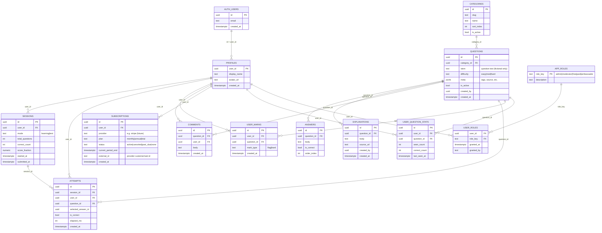

# MDprep — ERD (Step 1)

> Logical data model targeting Supabase Postgres. Supabase `auth.users` is shown as an external identity source; application data links via `user_id` (UUID).

### Role & Access Notes (for Step 2)
- **Roles**: `app_roles` + `user_roles` enables multiple roles per user (e.g., `paid` and `ambassador`). Admin/moderator used for content ops.
- **Free vs Paid (10% bank)**: Implement via RLS predicate that deterministically gates a subset of `questions` for non-`paid` users (e.g., hash of `user_id` + `question_id` threshold or a server-side sampling view).
- **Comments (paid only)**: Insert/select on `comments` allowed only if user has role `paid`. Author’s `user_id` always returned.
- **No service-role keys** on client; use RLS exclusively, with optional Netlify functions for privileged admin ops (later).

